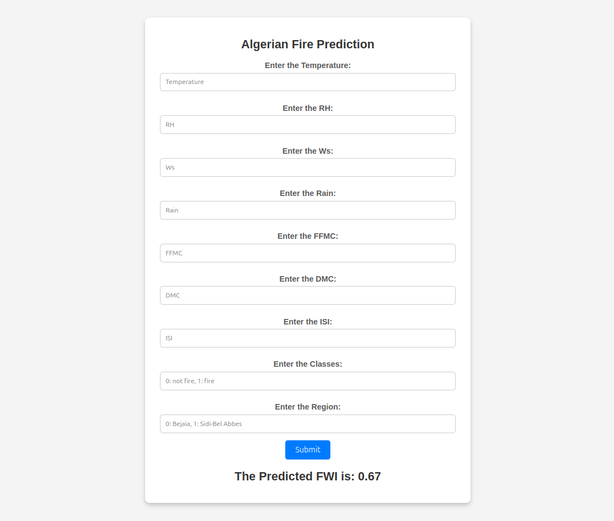

# Algerian Fire Prediction

## Project Overview

The **Algerian Fire Prediction** project is a Flask-based web application that predicts the Forest Fire Weather Index (FWI) in Algeria based on various environmental factors. Using a pre-trained RidgeCV regression model, the app processes user-provided inputs and generates predictions on the likelihood of fire hazards in a given region. The goal is to provide a simple, interactive interface to predict fire risks in real time.

---

## Features

- **Dynamic Form-Based Input**: Users can input features such as: `Temperature`, `Relative Humidity (RH)`, `Wind Speed (Ws)`, `Rain`, `Fine Fuel Moisture Code (FFMC)`, `Duff Moisture Code (DMC)`, `Initial Spread Index (ISI)`, `Classes`, and `Region`.
- **Real-Time Prediction**: The app provides the predicted Forest Fire Weather Index (FWI) instantly based on the input values.
- **Model Integration**: Uses a pre-trained **RidgeCV regression model** to make predictions.
- **Interactive Web Interface**: Built with **Flask** for a smooth and intuitive user experience.

---

## Tech Stack

- **Backend**: Python (Flask)
- **Machine Learning**: Scikit-learn (RidgeCV Regression)
- **Frontend**: HTML, CSS
- **Deployment**: Flask Development Server

---

## Prerequisites

Before running the project, ensure the following are installed:

- Python 3.10+
- Flask
- scikit-learn
- pandas
- numpy
- pickle

## Installation and Setup

1. **Clone the repository**:
   ```bash
   git clone https://github.com/mShubham18/Algerian-Fire-Prediction
   cd Algerian-Fire-Prediction

2. **Install the required modules:**
    ```bash
    pip install -r requirements.txt

3. **Run the Flask app:**
    ```bash
    python app.py

4. **Workflow**
- **Screenshot :** <br /><br />
    
- **Screen Recording :** <br /><br />
    

## Example Input and Output

### Example Input:

    Temperature: 30
    RH: 45
    Ws: 6
    Rain: 0.1
    FFMC: 85.0
    DMC: 35.0
    ISI: 10.0
    Classes: 1
    Region: 2

### Example Output:

    The predicted FWI is: 72.54


**That's it folks, Happy Learning :)**

